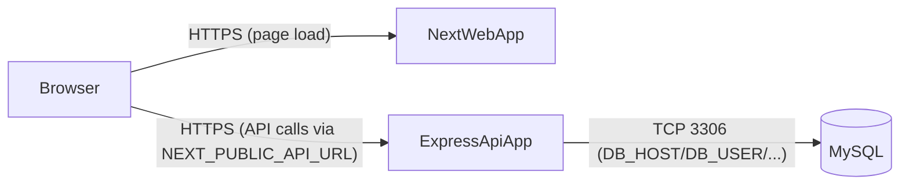

# Deployment (Hostinger Business plan)

This repo contains **two Node.js apps**:

- **API**: Express backend in [`/server`](./server)
- **Web**: Next.js app in [`/web`](./web)

Hostinger’s Business plan (Node.js web apps + MySQL) can host both as separate Node.js applications and a single MySQL database.

## Architecture



Key idea: in production the browser must call the API using the **public API URL** (not `localhost`).

## What runs where

| Component | Path | Production build | Production start |
|---|---|---|---|
| API | [`server/`](./server) | none | `npm start` (runs `node src/server.js`) |
| Web | [`web/`](./web) | `npm run build` | `npm start` (runs `next start`) |
| DB | MySQL | import SQL | managed by Hostinger |

## Prerequisites

- A Hostinger account with **Business web hosting** (or any plan that supports **Node.js web apps** + **MySQL**).
- A domain (optional, but recommended).
- Your code available in Hostinger either via **GitHub integration** or by uploading a ZIP.

Useful Hostinger docs (official):

- `https://www.hostinger.com/support/how-to-deploy-a-nodejs-website-in-hostinger/`
- `https://www.hostinger.com/support/node-js-hosting-options-at-hostinger/`

## Step 1. Create the MySQL database

1. In hPanel, create a **MySQL Database** and a **database user**.
2. Note the values Hostinger gives you:
   - database name (you will use this as `DB_NAME`)
   - username (`DB_USER`)
   - password (`DB_PASSWORD`)
   - host (`DB_HOST`)
   - port (`DB_PORT`, usually `3306`)

### Initialize schema and migrations

Base schema:

- [`server/schema.sql`](./server/schema.sql)

Migrations:

- [`server/migrations/add-cart-and-order-fields.sql`](./server/migrations/add-cart-and-order-fields.sql)
- [`server/migrations/is_phone_verified.sql`](./server/migrations/is_phone_verified.sql)
- [`server/migrations/admin-features.sql`](./server/migrations/admin-features.sql)

Recommended approach:

1. Import the base schema first (from `server/schema.sql`).
2. Then run each migration SQL against the same database.

Important notes:

- Hostinger often creates the database for you in hPanel. In that case, when importing/running SQL:
  - You may need to **remove or adjust** `CREATE DATABASE ...` and `USE ...` lines to match your actual database name.
- If a migration fails because a table/column already exists, verify what has already been applied and proceed carefully.

## Step 2. Deploy the API app (`server`) as a Node.js web app

Create a new Node.js application in hPanel and point it at the backend.

### Commands

- **Install**: `npm install` (or `npm ci` if Hostinger supports lockfile installs reliably)
- **Start**: `npm start`

The start script is defined in:

```1:9:/home/aremzy03/Document/cursor_projects/meenarh-logistics/server/package.json
  "scripts": {
    "dev": "nodemon src/server.js",
    "start": "node src/server.js"
  },
```

### Environment variables (API)

Set these in Hostinger’s Node.js app environment variables UI.

Required:

- `NODE_ENV`: `production`
- `JWT_SECRET`: strong random secret
- `DB_HOST`: from hPanel
- `DB_USER`: from hPanel
- `DB_PASSWORD`: from hPanel
- `DB_NAME`: from hPanel
- `DB_PORT`: usually `3306`

Recommended:

- `PORT`: **do not hardcode unless needed**. Many hosts inject `PORT` automatically; your server already uses `process.env.PORT`:

```1:9:/home/aremzy03/Document/cursor_projects/meenarh-logistics/server/src/server.js
require('dotenv').config();

const app = require('./app');

const PORT = process.env.PORT || 5000;

app.listen(PORT, () => {
  console.log(`Server running on port ${PORT}`);
});
```

Frontend link generation (recommended if you use password reset / verify flows):

- `FRONTEND_BASE_URL`: your deployed web origin, e.g. `https://www.example.com`

Optional (WhatsApp integration):

- `WHATSAPP_ACCESS_TOKEN`
- `WHATSAPP_PHONE_NUMBER_ID`
- `WHATSAPP_API_VERSION` (defaults to `v21.0`)
- `WHATSAPP_API_BASE_URL` (defaults to `https://graph.facebook.com`)

If WhatsApp vars are missing, the app warns but continues (non-fatal).

### Verify the API is alive

After deployment, open:

- `GET https://<your-api-domain-or-host>/health`

That route is defined here:

```30:38:/home/aremzy03/Document/cursor_projects/meenarh-logistics/server/src/app.js
// Health check
app.get('/health', (_req, res) => {
  res.json({ status: 'ok' });
});
```

## Step 3. Deploy the Web app (`web`) as a Node.js web app

Create another Node.js app in hPanel and point it at the frontend.

### Commands

- **Install**: `npm install` (or `npm ci`)
- **Build**: `npm run build`
- **Start**: `npm start`

### Environment variables (Web)

Critical:

- `NEXT_PUBLIC_API_URL`: the **public API base URL including `/api`**

Examples:

- If API is on `api.example.com`: `https://api.example.com/api`
- If API is on a path under the same domain: `https://www.example.com/api`

Why this matters:

The web app’s API client defaults to localhost unless `NEXT_PUBLIC_API_URL` is set:

```1:9:/home/aremzy03/Document/cursor_projects/meenarh-logistics/web/lib/api/client.ts
import axios from "axios";

// Create axios instance with base configuration
const apiClient = axios.create({
  baseURL: process.env.NEXT_PUBLIC_API_URL || "http://localhost:5000/api",
  headers: {
    "Content-Type": "application/json",
  },
});
```

Also note: `NEXT_PUBLIC_*` variables are typically **inlined at build time**, so set them **before** running `npm run build` on Hostinger.

## Domains, SSL, and recommended URL layout

Recommended:

- Web: `https://www.example.com` (or apex `https://example.com`)
- API: `https://api.example.com`

Then:

- `FRONTEND_BASE_URL=https://www.example.com`
- `NEXT_PUBLIC_API_URL=https://api.example.com/api`

Enable SSL for both apps in hPanel (usually automatic / managed).

## Deployment order (high signal)

1. Create MySQL DB + user in hPanel
2. Import [`server/schema.sql`](./server/schema.sql)
3. Apply SQL migrations in [`server/migrations/`](./server/migrations/)
4. Deploy API app (`server`) and verify `GET /health`
5. Set `NEXT_PUBLIC_API_URL` for the web app
6. Deploy web app (`web`)
7. Smoke test in the browser (login/signup, create order, etc.)

## Troubleshooting

- **Web still calls `http://localhost:5000/api` in production**
  - You built without `NEXT_PUBLIC_API_URL`. Set it in Hostinger and rebuild (`npm run build`) then restart.

- **DB connection fails**
  - Verify `DB_HOST` is the Hostinger-provided hostname (not always `localhost`).
  - Ensure the DB user has privileges on the chosen DB.
  - Confirm the port (`DB_PORT`) is correct.

- **Password reset / verify links point to localhost**
  - Set `FRONTEND_BASE_URL` on the API app.

- **WhatsApp warning about missing tokens**
  - Safe to ignore unless you intend to send WhatsApp messages; then set the WhatsApp env vars.

- **CORS issues in production**
  - The API currently uses `cors()` without an explicit `origin` allowlist. If you run into cross-origin issues or want tighter security, we can adjust CORS to an allowlist based on `FRONTEND_BASE_URL` (requires a small code change).

